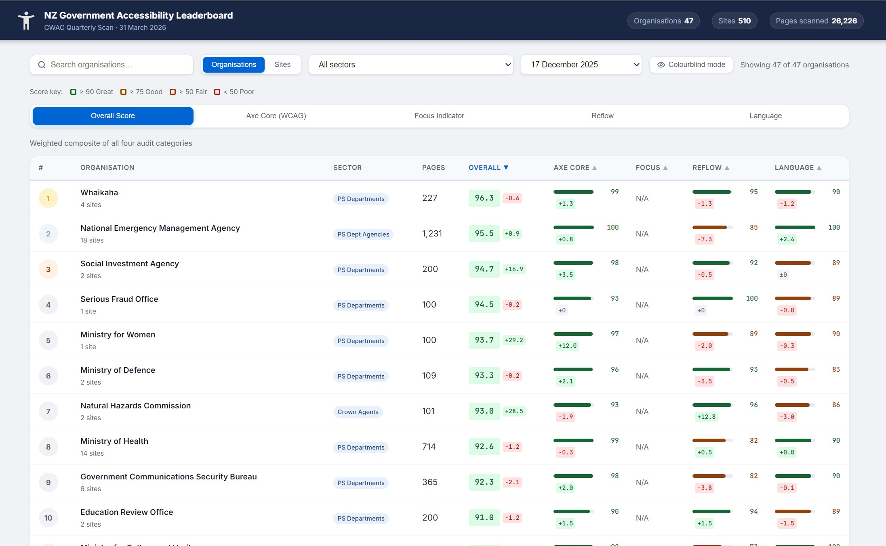

# NZ Government Accessibility Leaderboard

A lightweight single-page web app that visualises accessibility audit results from the NZ Government's quarterly **CWAC (Centralised Web Accessibility Checker)** scans.



## Local usage

The app fetches `data/leaderboard.json` at runtime, so it must be served over HTTP — opening `index.html` directly as a `file://` URL will be blocked by the browser's CORS policy. Start a local server from the project root:

```bat
python -m http.server 8765
```

Then open [http://127.0.0.1:8765/](http://127.0.0.1:8765/).

---

## Data source

Audit data comes from the NZ Government's **Centralised Web Accessibility Checker (CWAC)**, run quarterly by the Department of Internal Affairs. Raw CSV exports for each quarter are published at:

> [digital.govt.nz — Website scores (CWAC)](https://www.digital.govt.nz/standards-and-guidance/nz-government-web-standards/centralised-web-accessibility-checker-cwac/website-scores-cwac)

Each quarterly export is a folder of CSV files covering all in-scope NZ Government websites.

---

## Project structure

```bat
govta11yleaderboard/
├── index.html                          # SPA shell
├── app.js                              # Frontend logic (vanilla JS, no frameworks)
├── styles.css                          # All styles (CSS custom properties)
├── process_data.py                     # CSV → JSON data pipeline
├── data/
│   └── leaderboard.json                # Pre-aggregated data consumed by the frontend
├── 2025-06-30_quarterly_cwac_scan/     # Raw CSV export — Q2 2025
├── 2025-09-29_quarterly_cwac_scan/     # Raw CSV export — Q3 2025
├── 2025-12-17_quarterly_cwac_scan/     # Raw CSV export — Q4 2025
└── 2026-03-31_quarterly_cwac_scan/     # Raw CSV export — Q1 2026
```

---

## Scoring methodology

Each organisation and site is scored 0–100 across four dimensions, then combined into a weighted overall score.

| Dimension | Weight | How it's calculated |
| --- | --- | --- |
| **Axe Core** | 40 % | % of pages with zero WCAG violations (template-deduplicated via `axe_core_audit_template_aware.csv`) |
| **Focus Indicator** | 30 % | % of pages where all interactive elements have a visible focus ring |
| **Reflow** | 20 % | % of pages with no horizontal overflow at a 320 px viewport width |
| **Language** | 10 % | Flesch-Kincaid grade ≤ 8 → 100 pts; −5 pts per grade above 8 |

Score bands: **Great** ≥ 90 · **Good** ≥ 75 · **Fair** ≥ 50 · **Poor** < 50

---

## Adding a new scan quarter

1. Download the new quarter's CSV export from [digital.govt.nz](https://www.digital.govt.nz/standards-and-guidance/nz-government-web-standards/centralised-web-accessibility-checker-cwac/website-scores-cwac) and place the folder in the workspace root, named `YYYY-MM-DD_quarterly_cwac_scan/` (e.g. `2026-06-30_quarterly_cwac_scan/`).
2. Run the processor from the workspace root:

   ```py
   python process_data.py
   ```

   The script **auto-discovers** all `YYYY-MM-DD_quarterly_cwac_scan/` folders — no constants to edit. It regenerates `data/leaderboard.json` with the latest scores and a full history for every organisation and site. The UI's **Compare to** dropdown is populated automatically with all available past scans.

> **Note:** If a scan is missing `focus_indicator_audit.csv`, the focus score will be `null` and the overall score is recomputed using the remaining three dimensions with proportionally renormalised weights.

### Expected CSV files inside the scan folder

| File | Used for |
| --- | --- |
| `{date}_pages_scanned.csv` | Organisation → site mapping, page counts, sectors |
| `{date}_axe_core_audit_template_aware.csv` | WCAG violation counts (template-deduplicated) |
| `{date}_focus_indicator_audit.csv` | Focus visibility issues |
| `{date}_reflow_audit.csv` | Horizontal overflow at 320 px |
| `{date}_language_audit.csv` | Flesch-Kincaid and SMOG readability grades |

---

## Frontend features

- **Organisation view** — ranks all 47 organisations by overall score (default)
- **Sites view** — ranks all 510 individual sites; filterable by organisation
- **5 category tabs** — Overall · Axe Core · Focus · Reflow · Language (each shows relevant columns)
- **Sector filter** — narrow to a single government sector
- **Search** — live filter by organisation or site URL
- **Detail panel** — click any row to see a full score breakdown, violation impact counts, readability grades, and site list
- **Comparison selector** — pick any past scan quarter to compare scores against; delta badges update instantly
- **Colourblind mode** — toggle a blue/teal/orange/violet palette; preference saved in `localStorage`
- **Sortable columns** — click any scored column header to sort ascending/descending
- No build step, no dependencies, no server-side code

---

## Licence

This repository is dual-licensed by content type:

- **Code and project files** (`index.html`, `app.js`, `styles.css`, `process_data.py`, and other source/config files): [MIT License](LICENSE)
- **Dataset files** (quarterly CWAC CSV exports, zipped source exports, and derived `data/leaderboard.json`): [CC BY 4.0](LICENSE-DATA.md)

The CWAC dataset originates from data published by the New Zealand Government and is not covered by this repo's MIT software license.

### Data attribution (CC BY 4.0)

Source: New Zealand Government, Department of Internal Affairs, Centralised Web Accessibility Checker (CWAC) website scores.

- Source page: <https://www.digital.govt.nz/standards-and-guidance/nz-government-web-standards/centralised-web-accessibility-checker-cwac/website-scores-cwac>
- License: <https://creativecommons.org/licenses/by/4.0/>

If you reuse or redistribute the data, keep attribution and indicate whether you made changes, as required by CC BY 4.0.

---

## Tech stack

| Layer | Choice |
| --- | --- |
| Data pipeline | Python 3 (stdlib only — `csv`, `json`, `collections`) |
| Frontend | Vanilla HTML / CSS / JavaScript (ES2020) |
| Data storage | Static JSON file served alongside the HTML |
| Dev server | `python -m http.server` |
